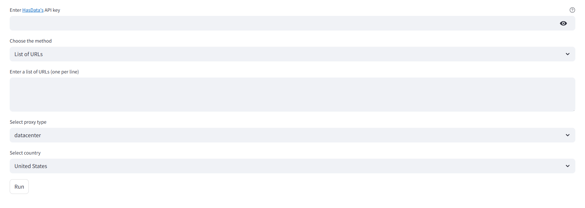

# 🔎 Email Scraper Tool
This is a simple, free tool built using HasData’s scraping APIs to extract email addresses and business contact data from websites, Google SERP, or Google Maps based on user-defined keywords or URLs.



## 🚀 Features

- 🔗 **Multiple Input Modes**:
  - List of URLs  
  - Google SERP keyword scraping  
  - Google Maps business scraping  

- 🌍 **Proxy Country Selection**  
  Customize proxy country for more localized scraping (e.g., US, UK, DE, etc.)

- 📧 **Extracted Data**
  - Emails  
  - Phone numbers  
  - Physical addresses  
  - Company names  

- 📤 **Download Formats**  
  Export results in **CSV** or **JSON**

- 🧠 **De-duplication & Merging**  
  Combines results from different sources and normalizes URLs to avoid duplicates

- ⏱️ **Concurrency-Aware Scraping**  
  Automatically adapts to your HasData API concurrency limits

## 🛠️ Installation

```
pip install -r requirements.txt
```

## ▶️ How to Run

```
streamlit run streamlit_app.py
```
